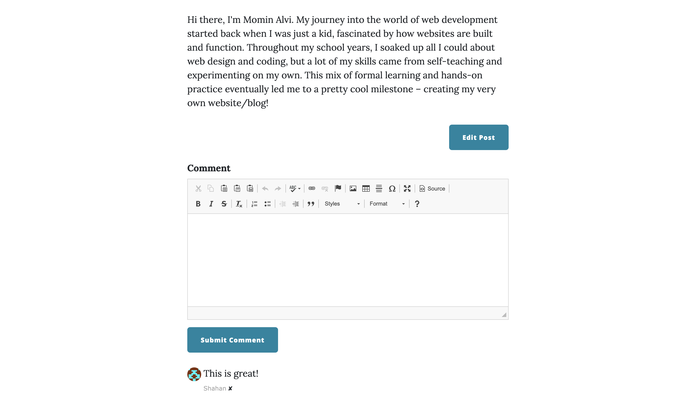

# Blog Application

## Overview
This Flask-powered blog application provides a feature-rich platform for blogging and user interaction. It integrates user authentication, blog post management, comment functionality, and admin privileges. The application is built with a focus on usability and scalability, leveraging Flask's lightweight yet powerful framework.

## Features
- **User Authentication**: Secure sign-up, login, and logout. Utilizes Flask-Login for session management.
- **Blog Post Management**: Users can create, edit, and delete their blog posts. Posts include titles, subtitles, images, and rich text content.
- **Comment System**: Users can post comments on blog articles, fostering community interaction.
- **Admin Privileges**: Admin users can manage posts and comments site-wide, ensuring content moderation.
- **Responsive UI**: The application uses Flask-Bootstrap for a responsive and aesthetically pleasing user interface.
- **Email Integration**: The contact form functionality sends emails using SMTP, allowing for user inquiries and communication.
- **Database Integration**: Uses Flask-SQLAlchemy for ORM-based database interactions, supporting SQLite and PostgreSQL.

## Technologies Used
- **Python**: The core programming language used.
- **Flask**: A micro web framework for Python.
- **Flask Extensions**: Flask-Bootstrap, Flask-Login, Flask-WTF, Flask-SQLAlchemy, Flask-CKEditor, Flask-Gravatar.
- **HTML/CSS**: For structuring and styling the web pages.
- **CKEditor**: Rich text editor for blog post creation.
- **SQLite/PostgreSQL**: Database systems for development and production environments.
- **SMTP**: For email sending functionality.

## Installation and Setup
 **Clone the Repository**:
   ```bash
   git clone [repository-url]
   cd blog-application
   ```

### Set Up a Virtual Environment (Optional but recommended):
```bash
python -m venv venv
source venv/bin/activate  # On Windows, use `venv\Scripts\activate`
```

### Install Required Packages:
```bash
pip install -r requirements.txt
```

### Environment Variables:
Set up `.env` file with necessary variables like `DB_URI`, `TWILIO_ACCOUNT_SID`, `TWILIO_AUTH_TOKEN`, and SMTP credentials.

### Initialize the Database:
Run the Flask application to create and set up the database schema.

### Run the Application:
```bash
flask run
```

### Usage
- Access the application through a web browser at `http://127.0.0.1:5000/`.
- Register to interact with blog posts, comment on posts.
- Only admin can edit or delete any posts and manage user comments.

# Admin View
## Homepage View


This is the homepage of the blog where all posts are listed.

## Admin View



This view is accessible by the admin to edit or delete posts and manage comments.


